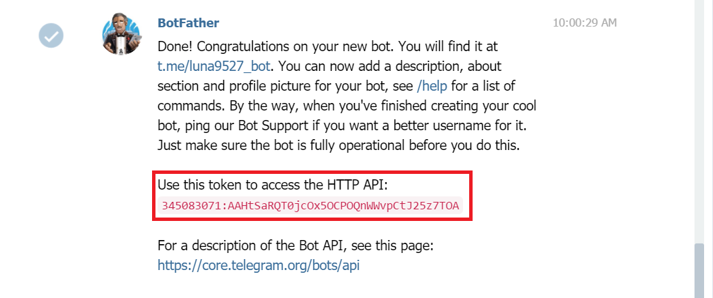
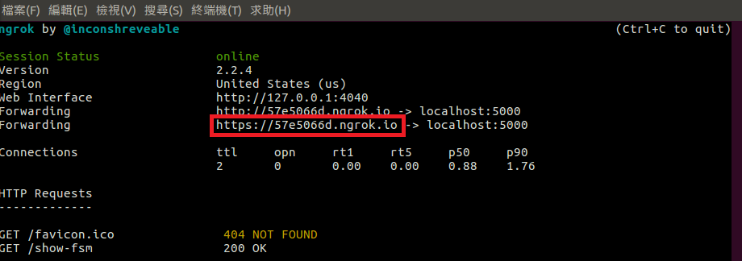
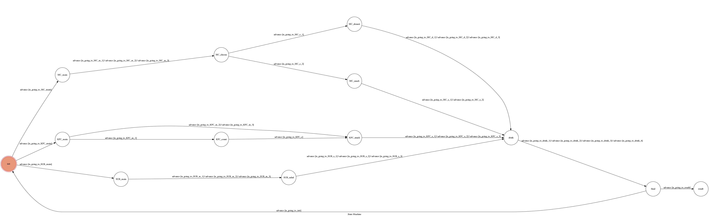

# TOC Project 2017

Code for TOC Project 2017

A telegram bot based on a finite state machine

## Setup

### Prerequisite
* Python 3

#### Install Dependency
```sh
pip install -r requirements.txt
```

* pygraphviz (For visualizing Finite State Machine)
    * [Setup pygraphviz on Ubuntu](http://www.jianshu.com/p/a3da7ecc5303)

### Secret Data
[Setup and background knowledge](http://lee-w.github.io/posts/bot/2017/03/create-a-telegram-echobot/) 

`API_TOKEN` and `WEBHOOK_URL` in app.py **MUST** be set to proper values.
Otherwise, you might not be able to run your code.

`API_TOKEN` must be fill in the value in the bottom red square.


### Run Locally
You can either setup https server or using `ngrok` as a proxy.

**`ngrok` would be used in the following instruction**

```sh
./ngrok http 5000
```

After that, `ngrok` would generate a https URL.


You should set `WEBHOOK_URL` (in app.py) to `your-https-URL/hook`(don't forgot the '/hook').

#### Run the sever

```sh
python3 app.py
```

## Finite State Machine


## Usage
The initial state is set to `init`.

Every time `init` state is triggered to `advance` to another state, follow the command choose the option then bot replies corresponding message and go to another state. 
Finally bot will show the dish you order and the prize you need to pay.

* init
	* Reply: "What do you want to eat ?"
	* Reply: "1)McDonald's"
	* Reply: "2)KFC"
	* Reply: "3)SUBWAY"

	* Input: "1"
		* Reply: "Welcome to McDonald's"
		* Reply: "Choose your main course :"
		* Reply: "1)Big Mac - $50"
		* Reply: "2)Chicken McNuggets - $40"
		* Reply: "3)McDouble - $45"

	* Input: "2"
		* Reply: "Welcome to KFC"
		* Reply: "Choose your main course :"
		* Reply: "1)Original Recipe Chicken - $20"
		* Reply: "2)Chicken Ceaser Twister - $40"
		* Reply: "3)Zinger Burger - $45"

	* Input: "3"
		* Reply: "Welcome to SUBWAY"
		* Reply: "Choose your main course :"
		* Reply: "1)Roast Beef Sandwich - $70"
		* Reply: "2)Meatball Marinara Sandwich - $60"
		* Reply: "3)Classic Tuna Sandwich - $65"


## Author
[potter903p](https://github.com/potter903p)
