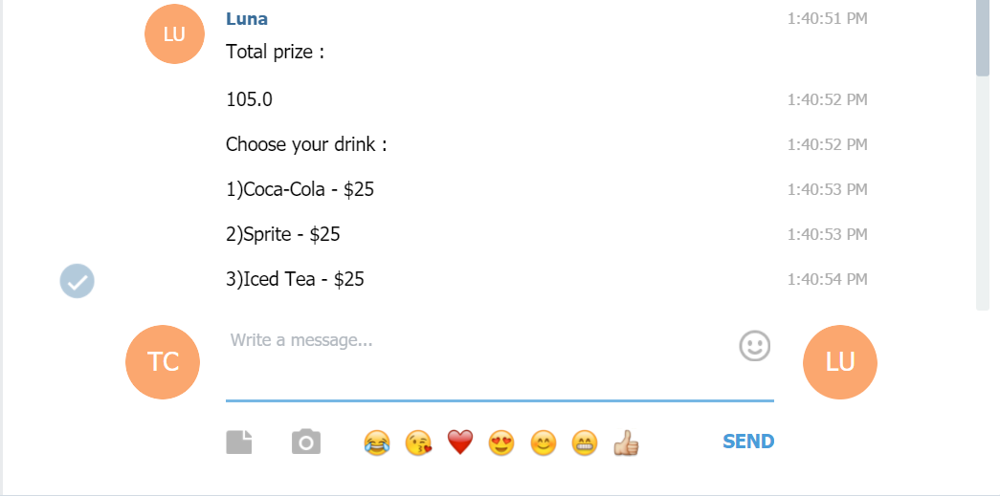

# TOC Project 2017

模擬機器人點餐系統

## Setup

### Prerequisite
* Python 3

#### Install Dependency
```sh
pip install -r requirements.txt
```

* pygraphviz (For visualizing Finite State Machine)
    * [Setup pygraphviz on Ubuntu](http://www.jianshu.com/p/a3da7ecc5303)

### Secret Data
[基本架構及背景知識](http://lee-w.github.io/posts/bot/2017/03/create-a-telegram-echobot/) 

`API_TOKEN` 和 `WEBHOOK_URL` in app.py **必須** 給定數值，否則無法運作.

`API_TOKEN` 需輸入如下方圖片紅色框框中的數值(bot_father回傳的)


### Run Locally
You can either setup https server or using `ngrok` as a proxy.

**`ngrok` would be used in the following instruction**

```sh
./ngrok http 5000
```

After that, `ngrok` would generate a https URL.


`WEBHOOK_URL` (in app.py) 需輸入上圖紅框內的數值 `your-https-URL/hook`(別忘記在字尾要自行加上 '/hook').

#### Run the sever

```sh
python app.py
```
(在助教的範例程式碼中是用python3，但我在虛擬機上跑會出現error所以這裡改用python.)

## Finite State Machine


## Usage
剛開始進入機器人會詢問你想要吃哪以家速食店的餐點，只要依序回答螢幕上出現的選項就會進一步詢問要選購的項目，最後再將選購的項目以及金額顯示出來.

###Example
* init
	* Reply: "What do you want to eat ?"
	* Reply: "1)McDonald's"
	* Reply: "2)KFC"
	* Reply: "3)SUBWAY"

	* Input: "1"
		* Reply: "Welcome to McDonald's"
		* Reply: "Choose your main course :"
		* Reply: "1)Big Mac - $50"
		* Reply: "2)Chicken McNuggets - $40"
		* Reply: "3)McDouble - $45"

	* Input: "2"
		* Reply: "Welcome to KFC"
		* Reply: "Choose your main course :"
		* Reply: "1)Original Recipe Chicken - $20"
		* Reply: "2)Chicken Ceaser Twister - $40"
		* Reply: "3)Zinger Burger - $45"

	* Input: "3"
		* Reply: "Welcome to SUBWAY"
		* Reply: "Choose your main course :"
		* Reply: "1)Roast Beef Sandwich - $70"
		* Reply: "2)Meatball Marinara Sandwich - $60"
		* Reply: "3)Classic Tuna Sandwich - $65"

###Demo picture





## Author
[potter903p](https://github.com/potter903p)
